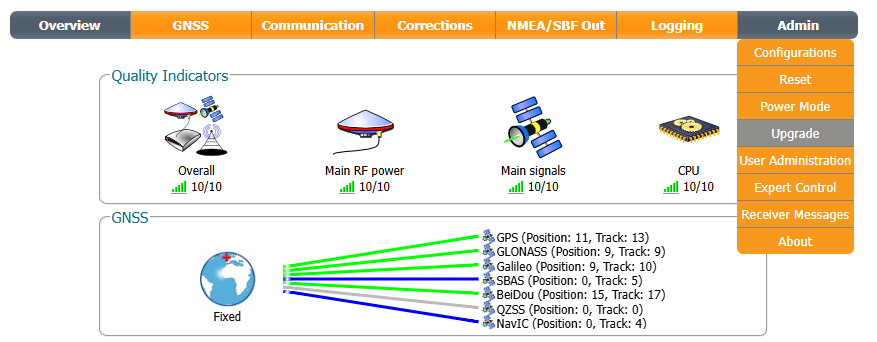
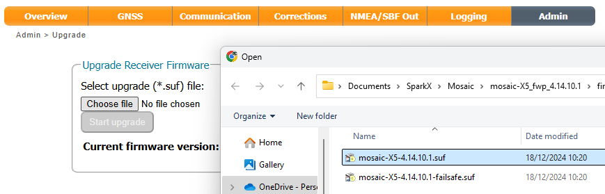
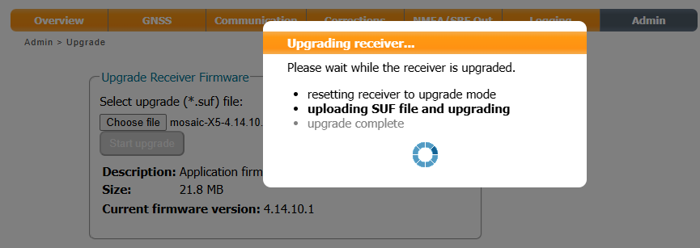
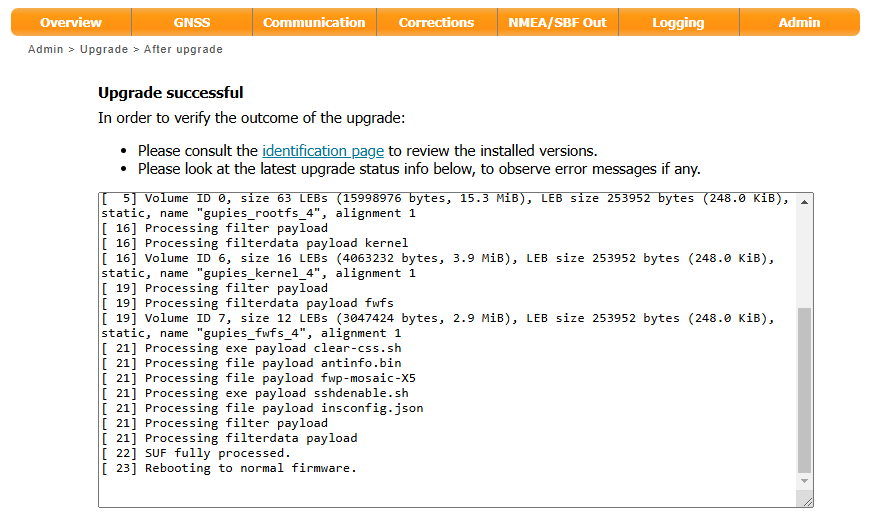
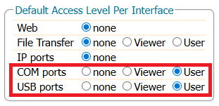

# Updating mosaic-X5 Firmware

<!--
Compatibility Icons
====================================================================================

:material-radiobox-marked:{ .support-full title="Feature Supported" }
:material-radiobox-indeterminate-variant:{ .support-partial title="Feature Partially Supported" }
:material-radiobox-blank:{ .support-none title="Feature Not Supported" }
-->

- EVK: :material-radiobox-blank:{ .support-none title="Feature Not Supported" }
- Facet mosaic: :material-radiobox-marked:{ .support-full title="Feature Supported" }
- Postcard: :material-radiobox-blank:{ .support-none title="Feature Not Supported" }
- Torch: :material-radiobox-blank:{ .support-none title="Feature Not Supported" }
- TX2: :material-radiobox-blank:{ .support-none title="Feature Not Supported" }

The Septentrio mosaic-X5 is the GNSS receiver inside the RTK Facet mosaic. The following describes how to update the firmware on the mosaic-X5.

1. As of the time of writing, we recommend using mosaic-X5 firmware [v4.14.10.1](https://www.septentrio.com/resources/mosaic-X5/mosaic-X5_fwp_4.14.10.1.zip) on all SparkFun / SparkPNT products running RTK Everywhere Firmware. Septentrio released v4.15.1 of the mosaic-X5 firmware in October 2025, but it includes a mandatory username and password for IP-based interfaces (webUI, Ethernet-over-USB, TCP, etc.) and requires changes to daily workflow. More details can be found [below](#mosaic-x5-firmware-4151).

2. Connect a USB-C cable between your computer and the RTK Facet mosaic.

3. Power on the Facet mosaic and allow ~10 seconds for the mosaic-X5 to start up.

4. On your computer, open a web browser and navigate to **192.168.3.1**. You are using Ethernet-over-USB to communicate with the mosaic-X5 directly. The X5's internal web page should appear.

5. Select the **Admin** tab and then **Upgrade**.

	<figure markdown>
	
	<figcaption markdown>
	The mosaic-X5 internal web page
	</figcaption>
	</figure>

6. Click on **Choose file** and select the firmware file you downloaded at step 1.

	<figure markdown>
	
	<figcaption markdown>
	Selecting the .SUF firmware file
	</figcaption>
	</figure>

7. Click **Start upgrade** to start the upgrade.

	<figure markdown>
	
	<figcaption markdown>
	Starting the firmware update
	</figcaption>
	</figure>

8. The upgrade will take approximately 30 seconds to complete. Check the web page dialog to ensure the firmware was updated successfully.

	<figure markdown>
	
	<figcaption markdown>
	Firmware update complete
	</figcaption>
	</figure>

### mosaic-X5 Firmware 4.15.1

Quoting Septentrio:

"As part of ongoing efforts to enhance device security and standardize access control, firmware released after August 1st 2025 introduces a mandatory user login requirement across all IP-based interfaces. This change affects how users access the system through the webUI, RxTools and command-line interfaces (CLI)."

On the mosaic-X5, the mandatory user-defined username and password were introduced in firmware v4.15.1 (released in October 2025).

If you upgrade to 4.15.1, you are required to:

- Create a secure user account (user-defined username and password) using factory credentials the first time you log in
- Thereafter, log in using that user-defined username and password on all IP-based interfaces

This includes the webUI interface on Ethernet-over-USB (192.168.3.1). But, importantly, *excludes* the COM and USB (virtual COM) ports - unless you also change the default access level for the those interfaces.

This has caused issues for some users, e.g. as discussed in [this forum post](https://community.sparkfun.com/t/new-septentrio-mosaic-x5-v4-15-1-firmware-has-password-security-added-any-implications-for-the-esp-32/68574).

We recently updated the [SparkFun RTK mosaic-X5](https://www.sparkfun.com/sparkfun-rtk-mosaic-x5.html) firmware so that the X5 username and password can be entered into the ESP32 firmware _**if needed**_. More details can be found in the [Release Notes](https://docs.sparkfun.com/SparkFun_RTK_mosaic-X5/software_overview/#esp32-firmware-update).

We currently do not plan to include that same feature in RTK Everywhere Firmware since:

- The Log-in procedure only applies to IP-based interfaces
- It does not apply to the COM ports - unless you also change the default access level for the COM ports
- This means the ESP32 does not need the user-defined username and password to communicate on COM - unless the default access level for the COM ports has been changed
- Even if the ESP32 were to have the username and password and were to *login* on COM using those, it does not remove the need to log in on IP interfaces. You still need to log in on each IP interface individually and separately

The default access level per interface are as shown below. Do not change the access level for the COM and USB ports unless you want to make life really complicated for yourself...

<figure markdown>

<figcaption markdown>
Default Access Level Per Interface with firmware 4.15.1
</figcaption>
</figure>

If you have upgraded to 4.15.1 and want to downgrade to 4.14.10.1, you need to:

- Perform a **FactoryReset** as described in [Cybersecurity guidelines: How can I recover connection to my receiver if I’ve lost my credentials?](https://customersupport.septentrio.com/s/article/How-can-I-recover-connection-to-my-receiver-if-I-ve-lost-my-credentials)
	- This is easiest if you connect to the X5 over USB and use a Terminal Emulator / Serial Console to issue the command on one of the USB virtual COM ports (USB1 or USB2)
	- You need to power cycle the RTK / X5 after sending the **FactoryReset**
	- The **FactoryReset** will delete the user-defined username and password
- When the factory reset is complete, **do not** enter a new username and password
- After the reset, it is possible to downgrade to 4.14.10.1 using RxTools RxUpgrade
	- RxUpgrade can connect on all of the X5's interfaces but it is easiest to use the USB virtual COM ports (USB1 or USB2)
	- If you try to connect using TCP (Ethernet-over-USB, 192.168.3.1), you will need to log in and will be back where you started from
	- Likewise, if you try to downgrade through the X5's webUI Admin tab, as described above, you will need to log in and will be back where you started from

#### Useful links

[mosaic-X5 v4.14.10.1 firmware](https://www.septentrio.com/resources/mosaic-X5/mosaic-X5_fwp_4.14.10.1.zip)

[Cybersecurity guidelines: Log-in procedure](https://customersupport.septentrio.com/s/article/Cybersecurity-guidelines-Log-in-procedure)

[Cybersecurity guidelines: How can I recover connection to my receiver if I’ve lost my credentials?](https://customersupport.septentrio.com/s/article/How-can-I-recover-connection-to-my-receiver-if-I-ve-lost-my-credentials)

[RxTools](./configure_with_rxtools.md)
