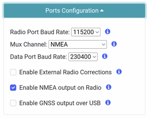
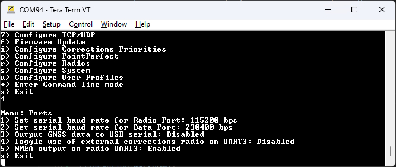
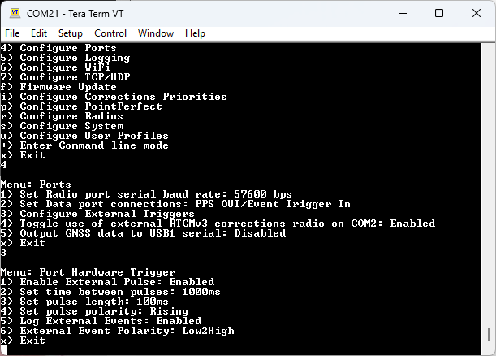

# Ports Menu

<!--
Compatibility Icons
====================================================================================

:material-radiobox-marked:{ .support-full title="Feature Supported" }
:material-radiobox-indeterminate-variant:{ .support-partial title="Feature Partially Supported" }
:material-radiobox-blank:{ .support-none title="Feature Not Supported" }
-->

- EVK: :material-radiobox-indeterminate-variant:{ .support-partial title="Feature Partially Supported" }
- Facet mosaic: :material-radiobox-marked:{ .support-full title="Feature Supported" }
- Postcard: :material-radiobox-indeterminate-variant:{ .support-partial title="Feature Partially Supported" }
- Torch: :material-radiobox-indeterminate-variant:{ .support-partial title="Feature Partially Supported" }

<figure markdown>

<figcaption markdown>
Setting the baud rates of the two available external ports
</figcaption>
</figure>

<figure markdown>

<figcaption markdown>
Baud rate configuration of Radio and Data ports
</figcaption>
</figure>

## Output GNSS Data over USB

<figure markdown>

<figcaption markdown>
Set output to GNSS data over USB Serial
</figcaption>
</figure>

Enabling **Output GNSS data to USB serial** will pipe all GNSS output (generally NMEA but also RTCM) to the USB serial connection. This permits a wired connection to be made on devices, such as the RTK Torch, that have only one external port (USB).

On RTK Facet mosaic, data can be output on the _USB1_ USB COM port.

!!! note
	To exit this mode, press **+++** to open the configuration menu.

Additionally, correction may be *sent* to the device over USB. RTCM corrections received over USB will follow the [Corrections Priority table](menu_corrections_priorities.md).

<figure markdown>

<figcaption markdown>
Example NMEA output over USB
</figcaption>
</figure>

## Radio Port

Available on devices that have an external **RADIO** port.

The **RADIO** port is connected directly to GNSS UART. By default, the port is set to 57600bps to match the [Serial Telemetry Radios](https://www.sparkfun.com/products/19032) that are recommended to be used with the RTK Facet (it is a plug-and-play solution). This can be set from 4800bps to 921600bps.

## Mux Channel

Available on devices that have a built-in multiplexer on the **DATA** port.

The **DATA** port on the RTK Facet is very flexible. Internally the **DATA** connector is connected to a digital mux allowing one of four software-selectable setups. By default, the port will be connected to the GNSS UART and output any messages via serial.

- **GNSS TX Out/RX In** - The TX pin outputs any enabled messages (NMEA, RTCM and binary). If supported, the RX pin can receive RTCM for RTK and can also receive configuration commands.
- **PPS OUT/Event Trigger In** - The TX pin outputs the pulse-per-second signal that is accurate to typically 30ns RMS. The RX pin is connected to the EXTINT pin on the ZED-F9P or EVENTA on the mosaic-X5, allowing events to be measured with incredibly accurate nano-second resolution. See the [Pulse Per Second and External Trigger](#pulse-per-second-and-external-trigger) section below for more information.
- **I2C SDA/SCL** - The TX pin operates as SCL, RX pin as SDA on the I2C bus. This allows additional sensors to be connected to the I2C bus, typically sharing it with the GNSS and OLED. This is useful for custom applications where you are using your own firmware.
- **ESP32 DAC Out/ADC In** - The TX pin operates as a DAC-capable GPIO on the ESP32. The RX pin operates as an ADC-capable input on the ESP32. This is useful for custom applications where you are using your own firmware. These pins have no function with the standard RTK Everywhere firmware.

## Data Port

<figure markdown>

<figcaption markdown>
</figcaption>
</figure>

The **DATA** port can be configured from 4800bps to 921600bps. The default depends on the GNSS model: e.g. 460800bps on LG290P; 230400 on other models. The default rate was chosen to support applications where a large number of messages are enabled and a large amount of data is sent. If you need to decrease the baud rate to 115200bps or other on the ZED-F9P, be sure to monitor the MON-COMM message within u-center for buffer overruns. A baud rate of 115200bps and the NMEA+RXM default configuration at 4Hz *will* cause buffer overruns.

<figure markdown>

<figcaption markdown>
Monitoring the COM ports on the ZED-F9P
</figcaption>
</figure>

If you must run the data port at lower speeds, and you need to enable a large number of messages and/or increase the fix frequency beyond 4Hz, be sure to verify that UART1 usage stays below 90%. The image above shows the UART1 becoming overwhelmed because the ZED cannot transmit at 115200bps fast enough.

Most applications do not need to plug anything into the **DATA** port. Most users will get their NMEA position data over Bluetooth. However, this port can be useful for sending position data to an embedded microcontroller or single-board computer. The pinout is 3.3V / TX / RX / GND. **3.3V** is provided by this connector to power a remote device if needed. While the port is capable of sourcing up to 600mA, we do not recommend more than 300mA. This port should not be connected to a power source.

### Pulse Per Second and External Trigger

<figure markdown>

<figcaption markdown>
Configuring the External Pulse and External Events over WiFi
</figcaption>
</figure>

<figure markdown>

<figcaption markdown>
Port menu showing mux data port connections
</figcaption>
</figure>

<figure markdown>

<figcaption markdown>
Configuring the External Pulse and External Events on RTK Facet mosaic
</figcaption>
</figure>

When **PPS OUT/Event Trigger In** is selected, the Pulse-Per-Second output from the GNSS is sent out of the TX pin of the DATA port. Once the RTK device has GNSS reception, this can be used as a *very* accurate time base.

The pulse width, frequency and polarity are configurable. The absolute timing accuracy depends on the GNSS.

The DATA port RX pin is routed to the GNSS EXTINT / EVENTA pin, allowing external events and triggers to be captured precisely. The absolute timing accuracy depends on the GNSS. For products using the u-blox ZED-F9P GNSS, the event timing is recorded in the UBX-TIM-TM2 binary message. On the mosaic-X5, the ExtEvent and ExtEventPVTCartesian SBF binary messages capture the timing and position of events.

For PPS, only the Black and Green wires are needed. For external events / triggers, only the Black and Orange wires are needed.

If you need to provide 3.3V to your system, the red wire can supply up to 600mA but we do not recommend sourcing more than 300mA.

- **Red** - 3.3V
- **Green** - TX (3.3V PPS output from the RTK device)
- **Orange** - RX (3.3V external trigger input into the RTK device)
- **Black** - GND

For products using the u-blox ZED-F9P GNSS, see the Timemark section of the [ZED-F9P Integration Manual](https://cdn.sparkfun.com/assets/learn_tutorials/1/8/5/7/ZED-F9P_IntegrationManual__UBX-18010802_.pdf) 